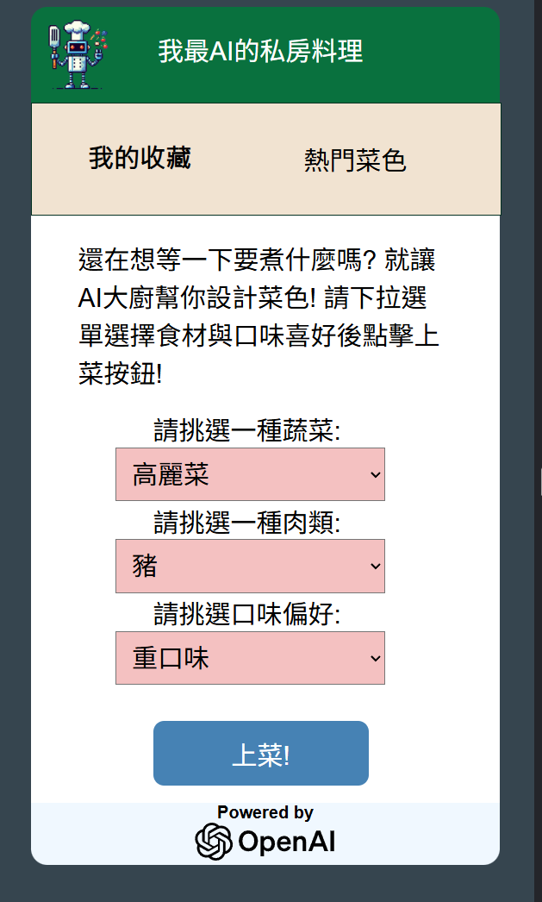

<h2>網站應用</h2>
使用Django框架開發AI應用與SQLite微型資料庫儲存用戶數據(菜單)，目標是除了可以查詢菜單以外，用戶能將喜愛的菜色加入資料庫
日後可以查詢

<h2>2025/6/23進度 :</h2>
初步功能皆已上線，透過python django的model框架(ORM架構)存取資料庫，資料庫初期先使用
SQLite3這個輕量級的資料庫，日後將驗證mysql是否一樣可以使用 
<h3>以下是手機上會看到的行動版網頁截圖</h3>
 

熱門菜色功能待數據量較龐大後再上線

